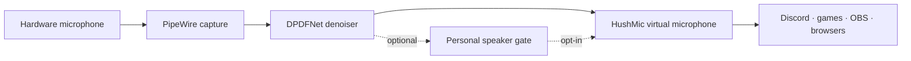

# HushMic-Ahuenno

[Русская версия / Russian version](README.ru.md)

<p align="center"></p>

[](https://www.linux.org/)
[](https://pipewire.org/)
[](https://www.rust-lang.org/)
[](#privacy)
[](#credits-and-licence)

I started this because I wanted a microphone that worked in Discord and games
without building a complicated EasyEffects graph every time. The short version:
it is a Linux noise suppressor, and sometimes it turns into a rather silly
voice experiment.

HushMic-Ahuenno creates a system-wide virtual microphone backed by PipeWire.
The normal path handles keyboard noise, fans, room hum and background chatter
before the audio reaches Discord, games, browsers, OBS or another compatible
app.

This is an independent fork that I have been changing while using it every day.
The repository contains the Rust real-time denoiser, plus a few optional
experiments for speaker personalization and phrase detection. The experiments
are useful, but they are not all equally finished.

Full Russian documentation: [`README.ru.md`](README.ru.md).

Project notes: [`CHANGELOG.md`](CHANGELOG.md) · [`ARCHITECTURE.md`](docs/ARCHITECTURE.md) · [`TRAINING.md`](docs/TRAINING.md) · [`CITATION.cff`](CITATION.cff)

<table>
<tr><th>48 kHz</th><th>10 ms hop</th><th>60 ms base latency</th><th>0 uploads</th></tr>
<tr><td>mono realtime path</td><td>480 samples</td><td>default denoiser graph</td><td>audio stays local</td></tr>
</table>



## What is actually here

- **DPDFNet denoiser** — the stable 48 kHz real-time noise-suppression path.
- **PipeWire virtual microphone** — one source that works across desktop apps.
- **Instant modes** — suppression, bypass and mute without reconnecting calls.
- **Real-time graph tuning** — the PipeWire quantum is aligned with the model
  hop to reduce underruns on demanding systems.
- **Optional personalization experiments** — streaming PyTorch/WeSep speaker
  extraction and a phrase-trigger prototype live in `scripts/`; they are not
  enabled by the normal installer.

The default path is local and does not upload audio or require an account.
Personal recordings, checkpoints and evaluation renders are intentionally not
part of this repository.

## Modes at a glance

| Mode | Typical timing | Compute | Best for |
| --- | ---: | --- | --- |
| DPDFNet quality | ~60 ms base graph latency | CPU | Everyday calls, games and streaming |
| DPDFNet light | Lower than quality mode | CPU | Older or busy CPUs |
| Fine-tuned DPDFNet v4 | Same 48 kHz streaming interface | CPU | Testing the fork's adapted denoiser |
| Personal speaker gate | 80 ms streaming chunks; verifier is opt-in | CUDA/PyTorch | Possible reduction of nearby foreign speech |
| Phrase trigger | Configurable delay buffer | CPU or CUDA | Deliberately unserious meme experiments |

The personal and phrase modes are optional layers. If their dependencies or
checkpoints are unavailable, the normal DPDFNet microphone remains usable.

## Model development

The noise-suppression model branch was fine-tuned during development and its
streaming runtime, graph quantum and inference behavior were adapted for this
fork's low-latency PipeWire deployment. The optional speaker-personalization branch
was additionally trained and evaluated on private target-speaker material.
The phrase detector is a separate small experiment trained with positive and
negative examples.

The resulting personal checkpoints and training recordings are intentionally
not bundled. This keeps the repository reproducible as code without exposing a
private voice dataset or claiming that one person's checkpoint fits every
microphone and room.

Aggregated private-development results are documented in
[`docs/BENCHMARKS.md`](docs/BENCHMARKS.md); raw evaluation artifacts are not
published.

The optional fine-tuned checkpoint has its own provenance and limitation notes
in [`docs/MODEL_CARD.md`](docs/MODEL_CARD.md). It is not enabled by default.

## Problems I ran into

I developed this fork while actually using it for calls and games, not in a
clean laboratory setting. These were the main problems I ran into:

| Problem | What it affects | Current approach |
| --- | --- | --- |
| Dirty training recordings | TV, people, PC fans and chair noise can teach the model the wrong thing | Keep raw and processed material separate; validate with speech and non-speech clips |
| Speech being cut at the beginning/end | Quiet starts, loud syllables and short pauses can look like non-target speech | Causal buffering, conservative gate reopening and explicit attack/release tuning |
| Metallic or “boxed” artifacts | Aggressive masks and inconsistent loudness are audible in dialogue | Streaming overlap-add tuning, output verification and less aggressive defaults |
| Latency versus quality | Larger context improves separation but hurts calls and games | The normal path stays low-latency; personalization remains opt-in |
| CPU/GPU scheduling | A model can be accurate yet underrun when the graph quantum is too small | Align PipeWire quantum with the model hop and expose lighter modes |
| Different microphones and gain levels | A gate trained at one level may reject the same voice at another level | RMS normalization, enrollment examples and configurable thresholds |
| Other people speaking nearby | A single microphone contains overlapping speakers | The speaker-gate may reduce foreign speech in some conditions, but cannot recover information that was never captured cleanly |

These trade-offs are why the personal separator and phrase trigger are
experimental. The default HushMic path must remain usable even when the
optional models fail, are missing or are not suitable for a particular room.

## Privacy

The normal HushMic path performs inference locally. No microphone stream,
enrollment audio or telemetry is sent to a server. Optional research scripts
also run locally, but their model files and recordings are deliberately left to
the user.

## Requirements

- Linux with PipeWire, WirePlumber and `pipewire-pulse`.
- x86-64 for the bundled runtime assets.
- Rust toolchain for building from source.
- A system tray is optional; the CLI works without one.

## Build from source

```bash
git clone https://github.com/qwertyuiopftft/HushMic-Ahuenno.git
cd HushMic-Ahuenno
./scripts/setup-assets.sh
cargo build --release
```

The tray application is `target/release/hushmic`. The denoiser library and
LADSPA plugin are built by the workspace as well.

## Usage

```bash
hushmic          # tray plus the live microphone controls
hushmic --tray   # tray only
hushmic --doctor # diagnostics
hushmic status   # current runtime state
hushmic mode     # print suppress, bypass, mute or off
hushmic mode mute
```

Select **HushMic** as the input device in Discord or another application. If
the application follows the system default, enable `set_default` in the
configuration or use the tray menu.

Configuration is stored in `~/.config/hushmic/config.toml`:

```toml
enabled     = true
mic         = ""                    # empty means the system default source
model       = "dpdfnet8_48khz_hr"   # use dpdfnet2 for a lighter model
attn_limit  = 100.0
set_default = false
autostart   = false
```

## Experimental extensions

See [`docs/EXPERIMENTAL.md`](docs/EXPERIMENTAL.md) for the optional speaker
personalization and phrase-trigger prototypes. They require separate Python,
PyTorch and model installations, add their own latency, and should be treated
as research features rather than production defaults.

Russian version: [`docs/EXPERIMENTAL.ru.md`](docs/EXPERIMENTAL.ru.md).

### The joke prototype

The phrase-trigger layer was made as a deliberately unserious meme experiment:
when it recognizes the target phrase, it can replace it with a prerecorded
sound. It is not a serious voice assistant, moderation tool or recommended
production feature. The tiny demo is here: [иди нахуй — example](examples/idi-nakhuy-demo.ogg).

<audio controls preload="metadata" src="https://raw.githubusercontent.com/qwertyuiopftft/HushMic-Ahuenno/main/examples/idi-nakhuy-demo.ogg"></audio>

It is included to demonstrate the trigger path, not as a claim that the model
is generally useful or production-ready.

## Architecture

1. `hushmic-denoiser` receives mono 48 kHz frames and runs DPDFNet through
   ONNX Runtime.
2. The LADSPA/PipeWire layer performs streaming overlap-add processing.
3. `hushmic` manages the virtual source, tray controls, watchdog and routing.

The default chain is designed to keep the microphone usable during calls and
games. More aggressive personalization is opt-in so it cannot silently break
the normal microphone path.

## Credits and licence

The denoiser is based on [DPDFNet](https://github.com/ceva-ip/DPDFNet) and the
streaming design follows ideas from
[DeepFilterNet](https://github.com/Rikorose/DeepFilterNet). The project is
dual-licensed under [MIT](LICENSE-MIT) or
[Apache-2.0](LICENSE-APACHE), at your option.

Issues and pull requests are welcome. Please do not upload private recordings,
speaker embeddings or proprietary model weights.
