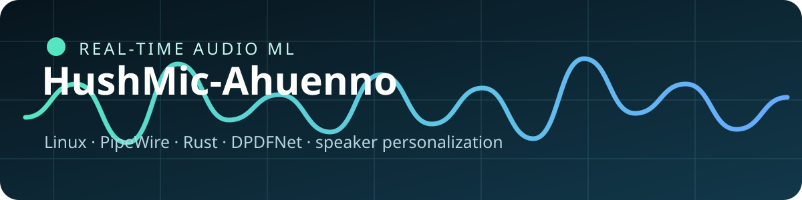

# HushMic

[Английская версия / English version](README.md)

<p align="center"></p>

Я начал этот проект, потому что хотел нормальный микрофон для Discord и игр без
необходимости каждый раз собирать сложный граф в EasyEffects. Если коротко:
это шумодав для Linux, который иногда превращается в довольно глупый голосовой
эксперимент.

HushMic-Ahuenno создаёт системный виртуальный микрофон на базе PipeWire.
Обычный путь убирает шум клавиатуры, вентиляторов, гул комнаты и разговоры на
фоне до того, как звук попадает в Discord, игры, браузеры, OBS и другие
приложения.

Это самостоятельный форк, который я менял прямо по ходу ежедневного
использования. В репозитории находятся основной Rust-шумодав и несколько
экспериментов с персонализацией голоса и распознаванием фразы. Эксперименты
полезные, но закончены они не одинаково хорошо.

Подробнее: [`CHANGELOG.ru.md`](CHANGELOG.ru.md) ·
[`ARCHITECTURE.ru.md`](docs/ARCHITECTURE.ru.md) ·
[`MODEL_ARCHITECTURE.ru.md`](docs/MODEL_ARCHITECTURE.ru.md) ·
[`TRAINING.ru.md`](docs/TRAINING.ru.md) · [`CITATION.cff`](CITATION.cff)

## Что входит в проект

- **DPDFNet-шумодав:** стабильный потоковый путь 48 кГц.
- **Виртуальный микрофон PipeWire:** один источник для всех приложений.
- **Мгновенные режимы:** шумодав, обход обработки и отключение микрофона без
  переподключения звонка.
- **Настройка графа реального времени:** квант PipeWire согласован с шагом
  модели, чтобы снизить вероятность пропусков звука.
- **Персонализация голоса:** необязательный PyTorch/WeSep фильтр целевого
  голоса,
  который можно обучить под свой голос.

Основной путь работает локально и не загружает звук в интернет. Личные записи,
эмбеддинги и веса моделей в репозиторий не добавляются.

## Режимы

| Режим | Типичная задержка | Вычисления | Для чего лучше всего |
| --- | ---: | --- | --- |
| DPDFNet quality | около 60 мс базовой задержки графа | CPU | Обычные звонки, игры и стримы |
| DPDFNet light | Ниже, чем у quality | CPU | Старый или загруженный процессор |
| Дообученный DPDFNet v4 | Тот же потоковый интерфейс 48 кГц | CPU | Проверка адаптированного шумодава форка |
| Персональный speaker-gate | Блоки по 80 мс; verifier включается отдельно | CUDA/PyTorch | Возможное снижение чужой речи рядом |

Персонализация является необязательным слоем. Если её зависимости или чекпойнт
недоступны, обычный DPDFNet-микрофон продолжает работать.

## Как я дорабатывал модели

Ветка модели шумоподавления проходила дообучение в процессе разработки, а её
потоковый runtime, квант графа и поведение инференса были адаптированы под
низколатентную работу этого форка через PipeWire. Необязательная ветка
персонализации голоса дополнительно обучалась и проверялась на закрытых
записях целевого диктора.

Личные чекпойнты и записи для обучения намеренно не включены. Так код остаётся
доступным для изучения, но приватный голосовой датасет не публикуется и не
создаётся впечатление, что один чекпойнт подходит для любого микрофона и
помещения.

Агрегированные результаты закрытых тестов описаны в
[`docs/BENCHMARKS.ru.md`](docs/BENCHMARKS.ru.md); исходные файлы оценки не
публикуются.

Для необязательного дообученного чекпойнта есть отдельная карточка модели:
[`docs/MODEL_CARD.ru.md`](docs/MODEL_CARD.ru.md). Подробная схема сети по
слоям описана в [`docs/MODEL_ARCHITECTURE.ru.md`](docs/MODEL_ARCHITECTURE.ru.md).
По умолчанию чекпойнт не включён.

## С какими проблемами я столкнулся

Я разрабатывал этот форк на реальных звонках и играх, а не в стерильных
лабораторных условиях. Вот с какими основными проблемами я столкнулся:

| Проблема | На что влияет | Что делаем сейчас |
| --- | --- | --- |
| Грязные записи для обучения | Телевизор, люди, вентиляторы ПК и скрип стула могут научить модель не тому | Я разделяю сырые и обработанные записи, проверяю речь и тишину отдельно |
| Обрезание начала или конца речи | Тихое начало, громкий слог или короткая пауза могут выглядеть как чужая речь | Я настраиваю потоковую буферизацию, открытие gate и attack/release |
| Металлические и «коробочные» артефакты | Агрессивная маска и разная громкость слышны в диалоге | Я настраиваю overlap-add, проверяю выход и уменьшаю агрессивность |
| Задержка против качества | Большой контекст улучшает разделение, но мешает звонкам и играм | Я оставляю обычный путь быстрым, а персонализацию включаю отдельно |
| Распределение нагрузки CPU/GPU | Точная модель может давать underrun при слишком маленьком quantum | Я согласовываю quantum PipeWire с шагом модели и оставляю облегчённые режимы |
| Разные микрофоны и усиление | Gate, обученный на одной громкости, может не узнать тот же голос на другой | Я использую RMS-нормализацию, несколько enrollment-примеров и настраиваемые пороги |
| Другие люди рядом | Один микрофон смешивает несколько голосов | Speaker-gate может снизить чужую речь в некоторых условиях, но не восстановит то, что микрофон не записал чисто |

Именно поэтому персональный разделитель остаётся экспериментальным. Основной
HushMic должен продолжать работать, даже если необязательная модель отсутствует,
сломалась или не подходит для конкретной комнаты.

## Установка и сборка

Нужны Linux с PipeWire, WirePlumber, `pipewire-pulse` и установленный Rust:

```bash
git clone https://github.com/qwertyuiopftft/HushMic-Ahuenno.git
cd HushMic-Ahuenno
./scripts/setup-assets.sh
cargo build --release
```

## Использование

```bash
hushmic          # трей и управление микрофоном
hushmic --tray   # только трей
hushmic --doctor # диагностика
hushmic status   # состояние работающей системы
hushmic mode     # показать suppress, bypass, mute или off
hushmic mode mute
```

В Discord или другой программе выбери **HushMic** как микрофон. Настройки
хранятся в `~/.config/hushmic/config.toml`:

```toml
enabled     = true
mic         = ""                    # пусто = системный источник по умолчанию
model       = "dpdfnet8_48khz_hr"   # dpdfnet2 легче для слабого CPU
attn_limit  = 100.0
set_default = false
autostart   = false
```

## Дополнительные эксперименты

Подробности находятся в [`docs/EXPERIMENTAL.ru.md`](docs/EXPERIMENTAL.ru.md).

## Архитектура

1. `hushmic-denoiser` принимает моно 48 кГц и запускает DPDFNet через ONNX
   Runtime.
2. LADSPA/PipeWire-слой выполняет потоковую обработку overlap-add.
3. `hushmic` управляет виртуальным источником, меню, watchdog и маршрутизацией.
4. Необязательный фильтр целевого голоса работает поверх основного пути и
   может попытаться снизить вывод чужой речи, не ломая обычный микрофон.

## Лицензия

Оригинальный проект HushMic создал и поддерживает
[Fovty](https://github.com/Fovty). Исходный код находится в
[оригинальном репозитории](https://github.com/Fovty/hushmic). Этот репозиторий
является самостоятельным форком с дополнительными экспериментами и
дообученным чекпойнтом.

Проект распространяется под [MIT](LICENSE-MIT) или
[Apache-2.0](LICENSE-APACHE), на выбор.

Не загружайте в задачи или запросы на слияние личные записи, эмбеддинги голоса
и проприетарные веса моделей.
