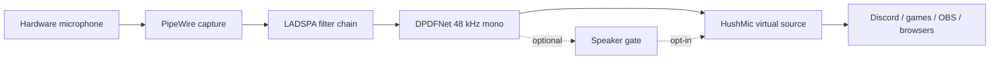

# Architecture overview

[Русская версия](ARCHITECTURE.ru.md)

## Default path

The Rust `hushmic` controller creates and supervises a PipeWire virtual source.
The `dpdfnet-ladspa` plugin owns the real-time hop loop, while
`hushmic-denoiser` provides the reusable streaming DSP and ONNX Runtime
integration. The default model consumes mono 48 kHz audio in 480-sample hops.

## Optional paths

- The GPU personalizer is a separate Python worker. It is not required by the
  normal installer and receives model/enrollment paths explicitly.
- The speaker gate is a target-speaker decision layer, not a voice-cloning
  system. It is intended to keep target speech open and suppress foreign
  speech when confidence is high, but it is not guaranteed to remove every
  nearby speaker.
- The phrase-trigger prototype is deliberately buffered and experimental.

## Failure boundaries

Optional workers may be stopped without taking down the default HushMic source.
This separation is intentional: a missing CUDA installation, checkpoint or
enrollment file must not turn the normal microphone into silence.
