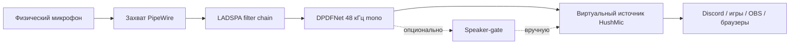

# Обзор архитектуры

[English version](ARCHITECTURE.md)

## Основной путь

Rust-контроллер `hushmic` создаёт и контролирует виртуальный источник PipeWire.
Плагин `dpdfnet-ladspa` выполняет realtime-обработку по блокам, а
`hushmic-denoiser` предоставляет общий DSP и интеграцию с ONNX Runtime.
Стандартная модель принимает моно 48 кГц блоками по 480 сэмплов.

## Необязательные пути

- GPU-персонализатор — отдельный Python-worker. Обычная установка ему не нужна;
  пути к моделям и enrollment передаются явно.
- Speaker-gate — слой решения о целевом дикторе, а не voice cloning. Он может
  помочь оставить целевую речь и снизить чужую, но не гарантирует удаление
  каждого голоса рядом.
- Phrase-trigger — намеренно буферизованный эксперимент.

## Границы отказа

Необязательные workers можно остановить, не ломая обычный источник HushMic.
Отсутствие CUDA, чекпойнта или enrollment-файла не должно превращать основной
микрофон в тишину.
