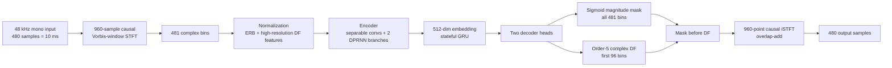

# Model architecture

[Русская версия](MODEL_ARCHITECTURE.ru.md)

This document describes the model used by the real-time path,
not the optional speaker gate. The numbers below
come from the public DPDFNet 48 kHz high-resolution implementation used by the
fine-tuning and ONNX-export scripts in this repository. An ONNX file contains
weights and graph operators, but does not by itself preserve every training
comment or experiment, so implementation-specific details are marked as such.

## Processing one audio block

The Rust front end keeps the analysis ring, recurrent state and synthesis
overlap buffer alive between callbacks. It never sends a whole recording to
the network: one 480-sample hop enters, one 480-sample hop leaves, and the
state is carried to the next hop.

## Signal representation

- **Sample rate and framing:** mono 48 kHz; `n_fft = 960` (20 ms window),
  `hop = 480` (10 ms, 50% overlap).
- **Window:** the Vorbis/sin-of-sin-squared window used by both STFT and iSTFT;
  the overlap-add pair has a one-hop framing delay.
- **Spectrum:** the real signal is represented by 481 positive-frequency
  bins, each with real and imaginary components.
- **Features:** one branch projects magnitude information to 32 ERB bands; a
  second high-resolution branch keeps the first 96 frequency bins for the
  deep-filter (DF) correction. Stateful running normalization is part of the
  streaming model.
- **Bounded context:** the exported quality configuration uses two-frame
  convolution/DF lookahead internally; the complete graph latency is documented
  as about 60 ms in the runtime README.

## Neural network

The shipped quality configuration is `DPDFNet48HR` with approximately 3.634M
trainable parameters and eight DPRNN blocks in each of the ERB and DF encoder
branches (`dprnn_num_blocks=8`). It is a compact streaming
convolutional/recurrent separator with a small bounded lookahead, rather than a
transformer or a voice-cloning model.

1. **Encoder.** Separable 2-D convolutions compress frequency. The ERB path
   downsamples by factors 3, 2 and 2; the high-resolution DF path downsamples
   by 2. Their representations are projected and concatenated into a shared
   512-dimensional embedding.
2. **Temporal memory.** The encoder embedding uses a stateful GRU. Each
   convolutional branch also has streaming cyclic buffers, and each DPRNN stack
   alternates recurrent processing over its two feature axes. The exported
   graph receives a flat state tensor and returns its updated state on every
   call; resetting that tensor starts a fresh acoustic context.
3. **Decoders.** A skip-connected ERB decoder upsamples the compressed
   representation with sub-pixel/transpose-convolution equivalents and emits
   a sigmoid magnitude mask for all 481 bins. A separate DF decoder emits
   order-5 complex correction coefficients for the first 96 bins.
4. **Spectral application.** In the default `before_df` path, the magnitude
   mask first suppresses stationary and transient interference. The learned
   multi-frame DF operator then refines phase and local spectral detail in its
   high-resolution band. The untouched upper band comes from the ERB mask.
5. **Synthesis.** The enhanced complex spectrum is mirrored to a full 960-point
   spectrum, transformed with iSTFT, windowed and overlap-added. The plugin
   emits the next 480 samples to PipeWire.

The graph also estimates a local signal-to-noise proxy (`lsnr`), but HushMic
does not use that value as a speaker identity decision. Attenuation limiting,
mode switching and mute ramps are runtime controls around the model output.

## What was fine-tuned here

The optional `dpdfnet8_48khz_hushmic_finetuned_v4.onnx` keeps the same input,
state tensor and output contract as the base model. Fine-tuning changed the
weights, not the PipeWire protocol or the streaming tensor shapes. The run
used a mixture of public speech/noise material and private target-microphone
recordings; the private recordings and checkpoints are not published. The
training script also used the original model as a teacher for non-speech
regions and an explicit over-attenuation penalty, so the goal was to reduce
background suppression damage without making the model a target-speaker
recognizer.

The runtime changes in this fork include 480-sample scheduling, state
persistence, an attenuation cap, failure-safe output and PipeWire quantum
tuning. These changes are separate
from the learned weights. See [`MODEL_CARD.md`](MODEL_CARD.md),
[`TRAINING.md`](TRAINING.md) and [`BENCHMARKS.md`](BENCHMARKS.md) for provenance
and measured limitations.

## Separate experimental models

- **Speaker gate/personalizer:** an optional PyTorch/WeSep worker operating on
  16 kHz chunks. It compares the current embedding with enrolled target-speaker
  material and can gate output; it does not synthesize or “restore” a voice.
The optional layer is not required by the default HushMic path. In particular, the base
denoiser does not know who is speaking and cannot guarantee removal of every
nearby person from a single mixed microphone signal.

## What is included and what is not

The architecture and export code are public. The fine-tuned ONNX artifact is
published for experimentation, while the private recordings, enrollment
embeddings and raw evaluation audio remain excluded. Exact quality depends on
microphone placement, gain, room acoustics and the selected attenuation limit.
