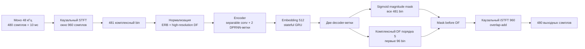

# Архитектура модели

[English version](MODEL_ARCHITECTURE.md)

Здесь описана модель, которая подключена к основному realtime-пути. Это не
speaker-gate. Числа ниже взяты из открытой
реализации DPDFNet 48 кГц высокого разрешения, используемой скриптами
дообучения и экспорта в ONNX. ONNX хранит веса и операции графа, но не все
комментарии экспериментов, поэтому детали, относящиеся именно к реализации,
помечены явно.

## Обработка одного аудиоблока

Rust-фронтенд сохраняет кольцевой буфер анализа, состояние рекуррентных слоёв
и буфер overlap-add между callback-ами. В сеть не отправляется целая запись:
входит один блок из 480 сэмплов, выходит один блок, а состояние переносится
на следующий.

## Представление сигнала

- **Частота и кадрирование:** моно 48 кГц; `n_fft = 960` (окно 20 мс),
  `hop = 480` (10 мс, перекрытие 50%).
- **Окно:** Vorbis/sin-of-sin-squared в STFT и iSTFT; пара overlap-add даёт
  задержку кадрирования в один hop.
- **Спектр:** для вещественного сигнала используются 481 положительный
  частотный bin, в каждом хранятся real и imaginary компоненты.
- **Признаки:** одна ветка переводит амплитуду в 32 ERB-полосы; вторая
  high-resolution DF-ветка сохраняет первые 96 частотных bin. Потоковая
  нормализация тоже хранит состояние.
- **Ограниченный контекст:** в экспортированной quality-конфигурации внутри
  используются два кадра lookahead для свёрточной и DF-ветки; полная задержка
  графа в runtime-документации указана примерно как 60 мс.

## Нейросеть

Конфигурация quality называется `DPDFNet48HR`. В ней примерно 3,634 млн обучаемых параметров
и по восемь DPRNN-блоков в каждой из ERB- и DF-веток encoder-а
(`dprnn_num_blocks=8`). Это компактный потоковый сверточно-рекуррентный
сепаратор с небольшим ограниченным lookahead, а не transformer и не
voice-cloning.

1. **Encoder.** Separable 2-D свёртки сжимают частотную ось. ERB-ветка делает
   downsample с коэффициентами 3, 2 и 2. High-resolution DF-ветка использует
   коэффициентом 2. Затем признаки проецируются и объединяются в embedding
   размерности 512.
2. **Память по времени.** Для embedding используется stateful GRU. У
   сверточных веток есть потоковые cyclic buffer-ы, а DPRNN-стеки чередуют
   рекуррентную обработку по двум осям признаков. Экспортированный граф получает
   плоский state-тензор и возвращает обновлённый state на каждом вызове; сброс
   state начинает новый акустический контекст.
3. **Decoder-ы.** Skip-connected ERB-decoder восстанавливает частотное
   разрешение через sub-pixel/transpose-подобные свёртки и выдаёт sigmoid
   magnitude mask для всех 481 bin. Отдельный DF-decoder выдаёт комплексные
   коэффициенты порядка 5 для первых 96 bin.
4. **Применение в спектре.** В стандартном режиме `before_df` сначала
   применяется magnitude mask, подавляющая постоянные и резкие помехи. Затем
   multi-frame DF-оператор уточняет фазу и локальные детали в
   high-resolution-диапазоне. Верхняя часть спектра берётся из ERB-маски.
5. **Синтез.** Улучшенный комплексный спектр зеркально достраивается до полного
   спектра 960 точек, проходит iSTFT, умножается на окно и складывается в
   overlap-add. Плагин отдаёт следующие 480 сэмплов в PipeWire.

В графе также есть локальная оценка отношения сигнал/шум (`lsnr`), но HushMic
не использует её как решение о личности говорящего. Ограничение подавления,
режимы и mute-ramp являются runtime-контролями вокруг выхода модели.

## Что дообучалось в этом форке

Необязательный `dpdfnet8_48khz_hushmic_finetuned_v4.onnx` сохраняет тот же
формат входа, state-тензора и выхода, что и базовая модель. Дообучение изменило
веса, но не PipeWire-протокол и не размеры потоковых тензоров. В обучении
смешивались открытые записи речи/шума и закрытые записи целевого микрофона;
закрытые записи и чекпойнты не публикуются. Скрипт также использовал исходную
модель как teacher на участках без речи и штрафовал чрезмерное подавление,
Цель обучения состоит в том, чтобы меньше портить речь при удалении шума, а не
распознавать
«своего» диктора.

Изменения runtime включают блоки по 480 сэмплов, сохранение state, ограничитель
подавления, безопасный вывод при ошибке и настройку quantum PipeWire. Они отделены
от обученных весов. Подробности есть в [`MODEL_CARD.ru.md`](MODEL_CARD.ru.md),
[`TRAINING.ru.md`](TRAINING.ru.md) и [`BENCHMARKS.ru.md`](BENCHMARKS.ru.md).

## Отдельные экспериментальные модели

- **Speaker-gate/personalizer:** необязательный PyTorch/WeSep-worker с блоками
  16 кГц. Он сравнивает embedding текущего сигнала с enrollment целевого
  диктора и может закрывать вывод; голос он не синтезирует и не «восстанавливает».
Этот слой не нужен основному HushMic. Базовый шумодав не знает, кто говорит, и
не может гарантированно удалить каждого человека из смешанного сигнала одного
микрофона.

## Что опубликовано, а что нет

Архитектура и код экспорта открыты. Дообученный ONNX опубликован для
экспериментов, а личные записи, enrollment-embedding-и и сырые аудио оценки
исключены. Итоговое качество зависит от положения микрофона, усиления,
акустики комнаты и выбранного ограничения подавления.
